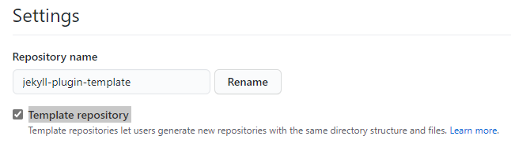

# Steps to create the template

> All the code snippets are also stored in a [GitHub Gist](https://gist.github.com/N7K4/60e142f2b4a83a3c749b2dd54436b41d). To get the gist information use 
`curl -s -o "gits-info.json" https://api.github.com/gists/60e142f2b4a83a3c749b2dd54436b41d ` and then collect the `raw_url` inside the `files` block!

Get code with `SSH` from [GitHub](https://github.com/n13org/jekyll-plugin-template), `config git` with user data and signing

```shell
git clone git@github.com:n13org/jekyll-plugin-template.git
cd jekyll-plugin-template
git config --local user.name "N7K4"
git config --local user.email "spam-and-junk@n13.org"
git config --local user.signingkey "1234567890ABCDEF"
git config --local commit.gpgsign "true"
```

Add `.gitignore` file, and commit it

```shell
curl -s -o ".gitignore" https://gist.githubusercontent.com/N7K4/60e142f2b4a83a3c749b2dd54436b41d/raw/b7c56985829f2574340b26a8fb46af34588c1e1f/.gitignore
git add .gitignore
git commit -m "Add .gitignore file"
git push
```

Create, push a workspace file and open the workspace in [VSCode](https://code.visualstudio.com/)

```shell
echo "{\"folders\": [{\"path\": \".\"}]}" > ./jekyll-plugin-template.code-workspace
git add jekyll-plugin-template.code-workspace
git commit -m "Add vscode workspace file"
git push
code -n ./jekyll-plugin-template.code-workspace
```

Make the project on GitHub [settings](https://github.com/n13org/jekyll-plugin-template/settings) to a `Template repository`.



Initialize [bundler](https://bundler.io/man/bundle-gem.1.html) with a new gem. Move the content of `lib` and `test`to the root. Replace `{MyCompany}` and `{MyProject}` with your values. In the example the values were `KargWare` and `PlugInTemplate`.

```shell
bundle gem jekyll-{MyCompany}-{MyProject} --test=minitest --no-mit --no-coc --no-exe --no-ext
mv jekyll-{MyCompany}-{MyProject}/lib/ ./
mv jekyll-{MyCompany}-{MyProject}/test/ ./
git add lib/* test/*
git commit -m "Add 'bundle gem' generated files"
git push
```

Move the generated `gemspec` file to the root folder. Check the data, remove unused blocks and solve `TODOs` inside the `gemspec` file and push the file

```shell
mv jekyll-{MyCompany}-{MyProject}/*.gemspec ./
git add *.gemspec
git commit -m "Add generated 'gemspec' file"
git push
```

Add the dependency to **jekyll** to `gemspec`

```ruby
Gem::Specification.new do |spec|
    ...
    spec.add_dependency 'jekyll', '>= 3.8'
    ...
end
```

```shell
git add *.gemspec
git commit -m "Set dependency to jekyll"
git push
```

Move the `Gemfile` to the root folder

```shell
mv jekyll-{MyCompany}-{MyProject}/Gemfile ./
git add Gemfile
git commit -m "Add Gemfile"
git push
```

Install `rubocop` as linting tool

```
bundle add rubocop --skip-instal
bundle add rubocop-minitest --skip-install
bundle add rubocop-performance --skip-install
git add Gemfile
git commit -m "Add rubocop as linting"
git push
```

## Folder and File Structure

The variables will be filled by the default-value. 

|Variable|Default-Value        |Note|
|--------|---------------------|---|
|FTName  |                     | Is a default variable, which is part of the extension. **My template is not using it.**|
|Company |KargWare             | The company is part of the namespaces and folder structure|
|Project |JekyllPlugInTemplate | The project is part of the namespaces and folder structure|

| Key         | Default             | Transform           |
|-------------|---------------------|---------------------|
| Company     | KargWare            | pascalcase          |
| Project     | NewPlugIn           | pascalcase          |
| ProjectName | jekyll-kw-newplugin | lowercase paramcase |

The file `jekyll-plugin-template.code-workspace` is part of the template and will not be generated.

In the text below are the variables wrapped with `<<VarName>>` without transformations. 

```text
├── .gitignore
├── .whitesource
├── Gemfile
├── Gemfile.lock
├── NextSteps.md
├── Rakefile
├── <<ProjectName>>.gemspec
├── lib
│   ├── <<ProjectName>>
│   │   ├── configuration.rb
│   │   └── version.rb
│   └── <<ProjectName>>.rb
└── test
    ├── <<ProjectName>>
    │   ├── configuration_test.rb
    │   └── version_test.rb
    └── test_helper.rb
```

Use the [VS-Code Fast Folder Structure Extension](https://marketplace.visualstudio.com/items?itemName=Huuums.vscode-fast-folder-structure), [Code](https://github.com/Huuums/vscode-fast-folder-structure) and cretae the template `NewJekyllPlugInAsRubyGem`

       "customVariables": [
          "Company",
          "Project"
        ],
        "omitParentDirectory": true,
